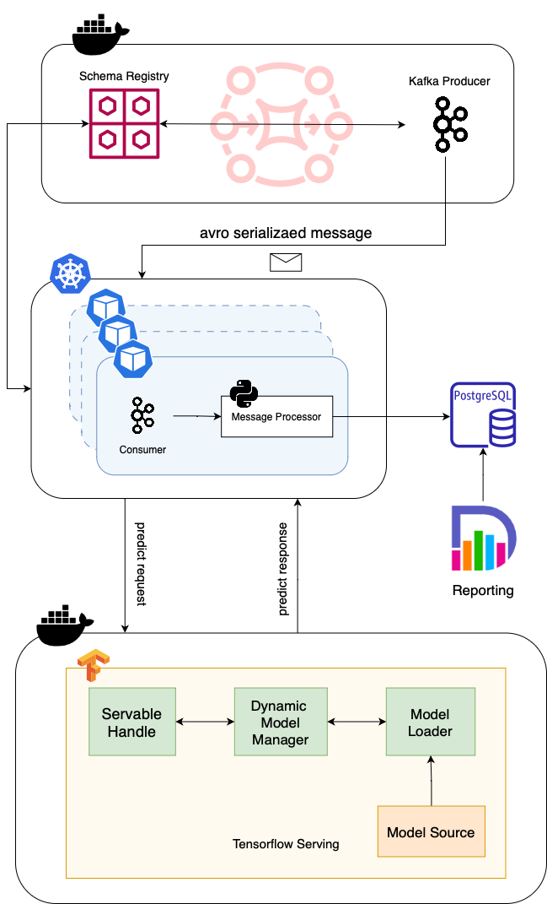

# Stream Anomaly Detection

SAD is the project accompanying my [dissertation thesis](https://docs.google.com/document/d/1flRnQu7tjmP0YCgXvZLUBV0qWTP-lzDvo7dnu5t6lhk/edit?usp=sharing).

## Architecture Overview



## Run

### model predictions server - tensorflow serving / SAD

```
docker run -t --rm -p 8501:8501 --name tfserving_fraud_detector -v /$PWD/models/fraud_detector:/models/fraud_detector -e MODEL_NAME=fraud_detector emacski/tensorflow-serving:latest-linux_arm64
```

### consumer - k8s / kafka
```
## build image
docker build -t consumer:latest -f consumer/Dockerfile .

## run consumer
kubectl run consumer --rm --tty -i --image consumer:latest --image-pull-policy Never --restart Never --namespace kafka-predict --command -- python3 -u ./consumer.py
```

### consumer logs
```
INFO:root: Received message on partition 0 with offset: 291468 and timestamp (1, 1685279133764)
INFO:root: Attempting to communicate with tfserver... 
[0.24830012]
INFO:root: Prediction request fulfilled.
INFO:root: Received message on partition 0 with offset: 291469 and timestamp (1, 1685279133765)
INFO:root: Attempting to communicate with tfserver... 
[5.90700958]
WARNING:root: Potential anomaly detected: 
... {{ message }}
```